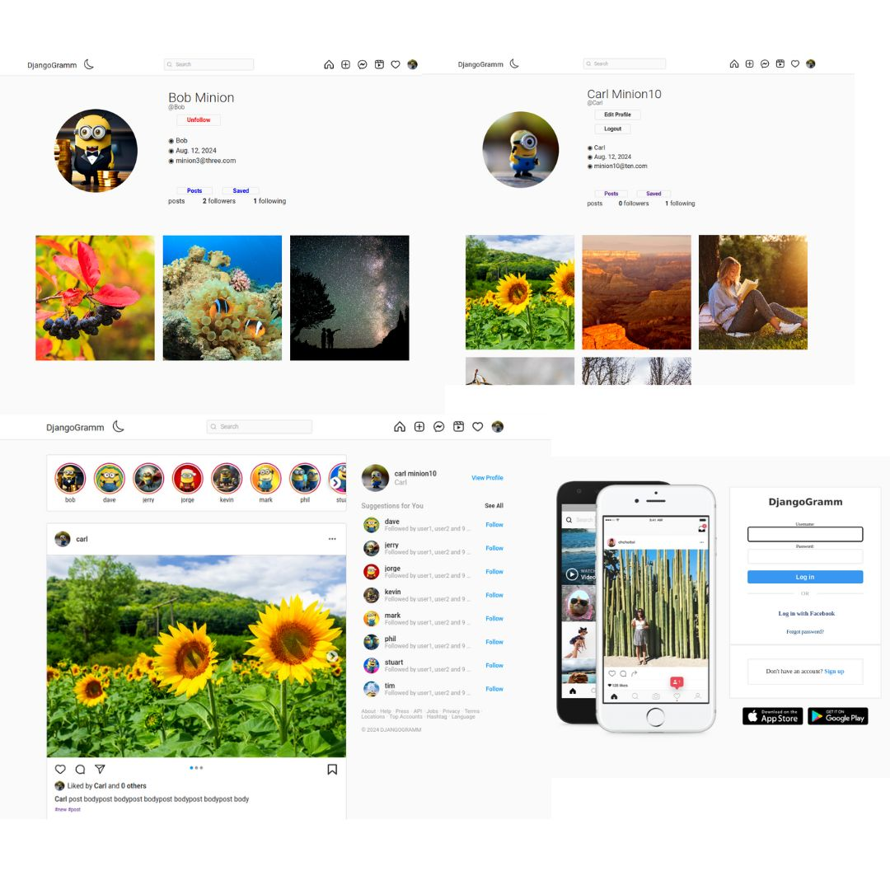

# DjangoGramm

A simple django application that repeats the idea of Instagram. 
Users can sign up, create posts, see posts in feed, like(unlike) and follow(unfollow) each other.

### Authentication

The application provides the authentication with email confirmation. Users must activate their 
accounts via email verification, or they will not be able to log in. After confirming the e-mail 
user will be redirected to the profile page. Users can login by facebook.

